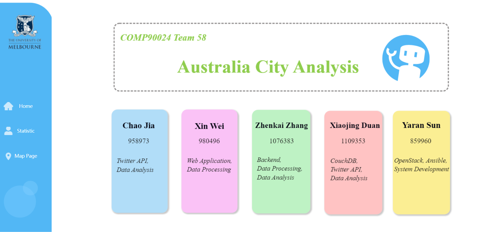

# CCC-Assignment2-Team58

---
Members of this project:

* [**Chao Jia**] - 958973
* [**Xin Wei**] - 980496
* [**Zhenkai Zhang**] - 1076383
* [**Xiaojing Duan**] - 1109353
* [**Yaran Sun**] - 859960

# Description of this project

The project introduces a cloud-based solution to analyze the data that is obtained from 5 Australian cities on Twitter and AURIN. In addition, the results of the analysis can be displayed on the Web application for a visual explanation. This project used the software configuration management tool ANSIBLE and docker technology, and deployed the cloud-based system to Melbourne Research Cloud.

# Project Demonstration Recording:

- 

# How to run our system step by step:

### 1. Prerequisite

Users need to install Ansible to run all shell files, and the OpenStack password for this project is `OGU4NzU4NzM1MzYxMmI5`.

### 2. Deploy instances on MRC

`./run_deployment_instance.sh`

`python inventory/record_instances.py`

### 3. Configure instances on MRC

`./run_config.sh`

### 4. Deploy database

`./run_database.sh`

### 5. Deploy back-end

`./run_back-end.sh`

### 6. Deploy web application

`./run_front-end.sh`

### 7. Deploy harvest

`./run_crawler.sh`

## Resource Access Links

- Website Access:  http://172.26.131.192:8080/

- CouchDB Access:  http://172.26.131.197:5984/_utils

- We can fill the `<query_data>` part with the keyword we want to gain the specified result, such as sentiment scores for city-level, sentiment scores for suburb-level, or the rate of being mention of COVID, etc.

- Flask API Access: http://172.26.131.192:8080/api/<query_data>

## The architecture of the system

